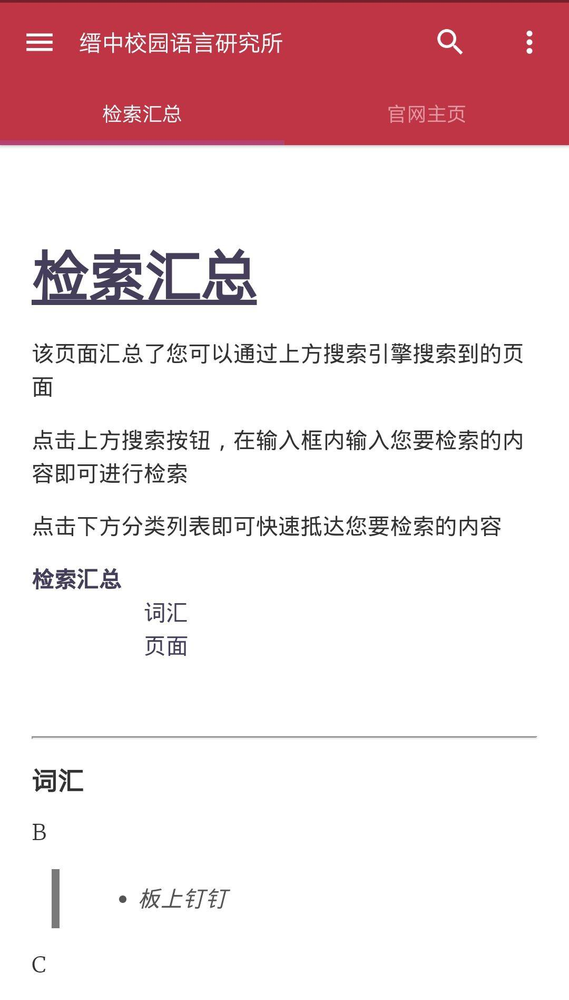

# GuideBook

> 这本指导手册*(GuideBook)*将帮助你了解缙云中学校园语言研究所移动端<u>ChinaRed</u>的使用方法。
>
> 在此鸣谢：
>
> -Hao Liu 
>
> 由他撰写的Typora Theme为该页面的样式提供了支持
>
> -Wendao Lee 
>
> 本手册的主要撰写者；研究所技术组成员
>
> -Shallow Dream  
>
> 研究所技术组组长；移动端项目负责人

[TOC]

#### 1.0 移动端简介

##### 1.1 什么是ChinaRed

`ChinaRed`是由<u>缙云中学校园语言研究所</u>技术组通过第三方工具制作的一款安卓app，其目的是为了方便手机端用户能够使用<u>研究所</u>提供的些许服务。

这些服务包括：

- 访问研究所官网，了解相关动态
- 查询研究所收录的各类词汇
- 使用第三方提供的Web服务

而`ChinaRed`则是该app的名称，同样也是该app的命名版本号。之所以如此取名，是因为它的开发与发布第一个测试版本都在2020年春节前后这一时间段内，故而我们命名它为`ChinaRed`，意为`“中国红”`。

##### 1.2 ChinaRed的功能

- [ ] 便捷用户访问[缙云中学校园语言研究所官网](https://www.otterdaily.cn/Index.html)
- [ ] 查询研究所收录的词汇
- [ ] 通过Channel板块使用第三方提供的Web服务

值得一提的是，ChinaRed的体积非常的小。因此，我们建议您一直保留该app在您的手机里，权当做个放在手机里的纪念品。。

##### 1.3 注意事项

1. **使用ChinaRed的大部分服务需要联网**。受限于第三方工具提供的支持与研究所各项服务的本身性质，ChinaRed的大部分服务都需要在网络环境才能使用。尽管ChinaRed会缓存一些加载过的内容，使得您可以在无网情况下浏览已经缓存的内容。但是ChinaRed的核心内容*如词汇查询*等都需要联网。
2. **ChinaRed有一项无用的使用权限：定位。还请您在安装好ChinaRed之后在手机设置中将它关闭**——虽然它默认是关闭的。这是使用第三方工具造成的一项冗杂权限要求，尽管我们保证该第三方的可信度，但是为了规避隐私泄露风险，还请您在安装后检查该项权限是否开启，如已经开启，请将它关闭。
3. ChinaRed的绝大多数服务基于Github的Pages服务支持。受到网络情况及Pages服务本身在国内的状态的影响，**您有时在使用ChinaRed时会遇见极长的加载时间的情况。还请您能够见谅。**
4. 缙云中学校园语言研究所技术组对于ChinaRed及其提供保留最终解释权与所有权。研究所可以在通过官方公众号或官网提前告知的情况下停止ChinaRed的维护及其提供的服务。

#### 2.0 使用帮助

我们在下方列出了一些可能能够帮助到您的条目。

##### 2.1 界面

当您打开ChinaRed时，展现在您面前的将会是这个界面：



其中，在`“检索汇总”`与`“官网主页”`下方的大量留白处为`显示页面`，它是您浏览的所有内容的加载区域，换句话讲，您所想要浏览的内容都会在这里显示。

而上方的深红色区域则为功能板块：


通过点击不同的图标，您可以使用不同的功能。

下面我们简单列出了各个不同的图标对应的功能：

-  **搜索键**，您可以通过点击它展开<u>搜索框</u>进行相关信息的搜索。

  搜索键是整个`ChinaRed`的核心内容。

- **侧边栏**。点击侧边栏，将会展开ChinaRed的侧边栏，里面包含一些额外服务。我们会在下方*<u>2.2侧边栏</u>*一节中简单介绍这些服务。

- **辅助栏**。点击它将会弹出简陋的辅助栏。里面包含退出程序等简陋的功能按键。

##### 2.2 侧边栏

点开侧边栏，您将会看到三个选项栏：


这三个栏目的功能分别为：

- `帮助GuideBook`，打开本帮助手册。*需要联网或已预先有过缓存*。
- `加公众号QQ`，打开手机QQ并进入到您与研究所的聊天界面。您可以通过它来快速添加我所公众号QQ或者与我们联系。
- `Channel`，进入Channel页面，使用由第三方提供的Web服务。

##### 2.3 关于Channel

**Channel是由研究所设计的一个Web服务板块**。它的用处为：**<u>拓展ChinaRed的功能</u>**，方便同学使用由第三方提供的一些Web服务。

简单地举个例子：年初新冠疫情初发时，我们在Channel里设置了由丁香园提供的疫情状况查询服务。这样子，一些使用ChinaRed的同学就可以在使用ChinaRed时或者突然想知道目前疫情状况时，能有个快捷的查询路口，而不需要专门上网去搜找或者下载新的App。

我们必须承认：Channel确实是一个鸡肋的功能，食之无味而又弃之可惜。但是出于提高ChinaRed本身价值的考虑，我们最终还是决定保留Channel板块。

```markdown
*你知道吗？
事实上Channel在刚开始立项的时候，由于立项组的粗心大意少打了一个'n'，使得该项目名变成了国际知名奢侈品香奈儿的品牌名。时隔几月后才被立项组成员发现并且纠正。
```

#### 3.0 其他

目前该手册暂时只有这些内容。

若您有其他疑惑，还请联系我所官方QQ号咨询。我们会根据您的反馈不断更新该帮助手册的内容。

> 《GuideBook》
>
> 最后更新时间:20/10/28

