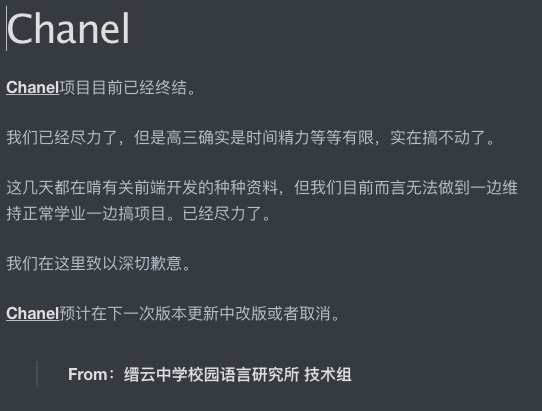

<!--Night-->

# 公告板

***

神奇的完整版公告板

由于我们一致认为这个完整版公告板存在的意义是让那些对缙云中学校园语言研究所过去的一些动态感兴趣的人查阅相关信息,因此我们将该页面的设置为黑夜主题——因为**,“往事皆应埋于黑夜之中”**.

***

### 最新(2020.7——目前)

> 2020.10.15 更新了官网，修补了图床。
>
> 2020.7.22 更改了图床，原先图床转为备用图床。
>
> 2020.7.21 取消了官方App的启动图。由于KPI接口的问题取消了更改的URL。
>
> 2020.7.21 官网绑定了域名www.otterdaily.cn,您可以通过www.otterdaily.cn/Index.html 访问官网
>
> 2020.7.20 官网更新完成.APP内测尚在进行中.
>
> 2020.7.19 问题已被修复
>
> 2020.7.18 **紧急通知:由于遇见未知问题,更新结束日期推迟一天**
>
> 2020.7.18 官网正式开始改版更新
>
> 2020.7.13 发布业务变更通知
>
> 
>
> 

### 2020.1——2020.2

> ### 一些杂七杂八的内容通知：
>
> #####**<u>2020.2.18 因为大部分成员要继续学业，研究所目前大部分业务暂停</u>**
>
> <u>2020.2.15</u> 修复了词汇检索表未及时更新的问题 [Tips:该问题是由于原本程序的网页定向错误造成的，下一次客户端更新会补上这个漏洞]()
>
> <u>2020.2.15</u> 更改了404页面的布局设计，对个别语句的表述不当进行修正
>
> <u>2020.2.15</u> 把以前录入词汇表的绝大部分词语录入检索系统。个别词汇因为存疑暂时搁浅，不做录入。如果发现词汇中存在错误，麻烦私聊公众号指正。
>
> #### [<u>2020.2.14</u>  祝大家情人节快乐！！！！]()
>
> <u>2020.2.13</u> 经过测试，发现ChinaRed在**非Wifi网络环境**下初始界面容易加载不出，**但搜索功能依然能够正常使用**。
>
> <u>2020.2.13</u> 修复Channel版块与手机页面不兼容的问题
>
> <u>2020.2.11</u> 初步重建了移动端，着手编写了GuideBook,暂时未写完，先更新版本查看效果。
>
> <u>2020.2.11</u> [更新了词库]()。
>
> <u>2020.2.10</u> [更新了词库]()。夹杂一个小通知：移动端的工程文件不知道怎么丢了233意思也就是说[移动端要重做]()，移动端的开发计划估计是真的要凉了。
>
> <u>2020.2.9</u> [因为学业原因,移动端开发计划停滞.]()
>
> <u>2020.1.23</u> [目前官网封闭，正在重新筹划中。]()

> <u>2020.1.23</u> 研究所移动端预计将在春节期间[向公众正式发布]()。移动端在接下来的测试中的定位为：[1.]()为公众提供一个<u>**快速查询研究所收录成果的平台**</u>（即现在已有的搜索引擎）[2]().**推送一些精品内容**。这同时也是目前我们的Chanel准备改版的方向。以及因为没有优质稿件，也没收到多少稿件，目前我所准备在移动端取消[创作者殿堂的板块]()，但它依然存在，只是不作为板块录入移动端了。
>
> <u>2020.1.22</u> 【关于Chanel项目的通知：】
>
> 
>
> <u>2020.1.21</u> 缙云中学校园语言研究所Android移动端内部测试推出。版本号[ChinaRed 0.1.0002]()。我们将在移动端上测试我们推出的 [创作者殿堂]() 以及 [Chanel](l) 两大功能板块。如果您愿意参加我们的内部测试，请私聊我所官方QQ公众号。
>
> 
>
> *移动端示例图*

